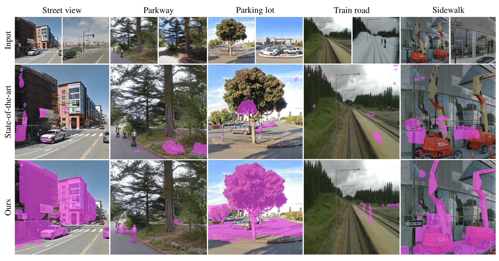

# Towards Generalizable Scene Change Detection

This repository represents the official implementation of the paper titled "Towards Generalizable Scene Change Detection (CVPR 2025)".

  <a href="https://1124jaewookim.github.io/"><strong>Jaewoo Kim</strong></a>
  ·  
  <a href="https://uehwan.github.io/people/Ue-Hwan-Kim/"><strong>Uehwan Kim</strong></a>
   
  <strong>CVPR 2025</strong>

   
   Comparative results of the current state-of-the-art model and our GeSCF on various unseen images.

## Code

For the full source code and instructions, please visit this [link](https://github.com/1124jaewookim/towards-generalizable-scene-change-detection/tree/main).

